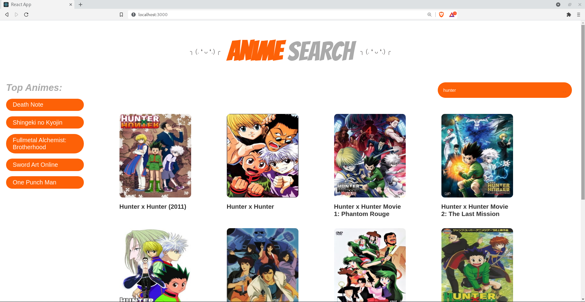

### ❇ ANIME DATABASE REACT APP❇

- Created with React.js, using [Anime Search APi][1] and Fetch

**Preview**

**Deploy on vercel**
Link: https://app-anime.vercel.app/
### Installation

-Clone the repository

-To install and run this proyect just type and execute

`npm install`

-Start the proyect with

`npm start`

👩‍💻

[1]: https://jikan.moe/ "Jikan Search API"